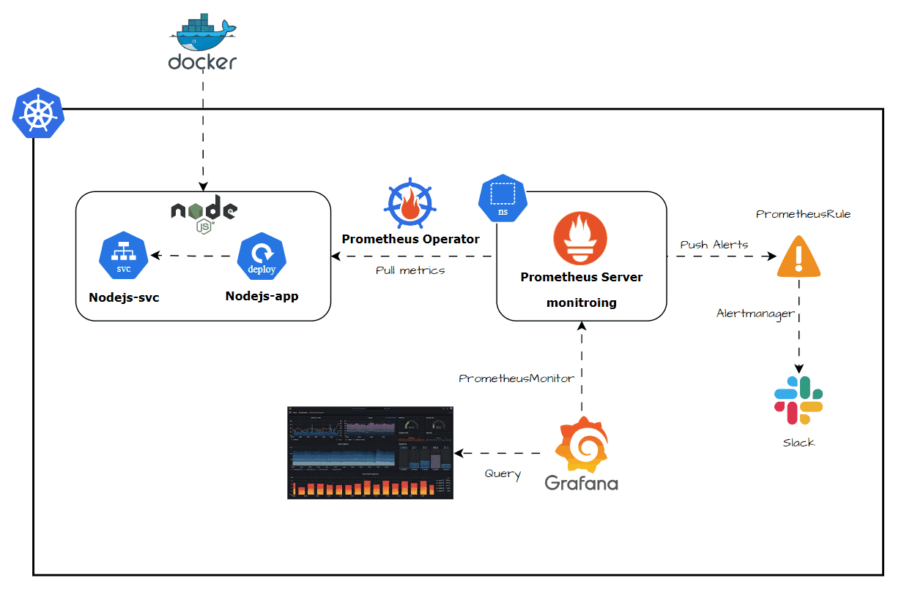
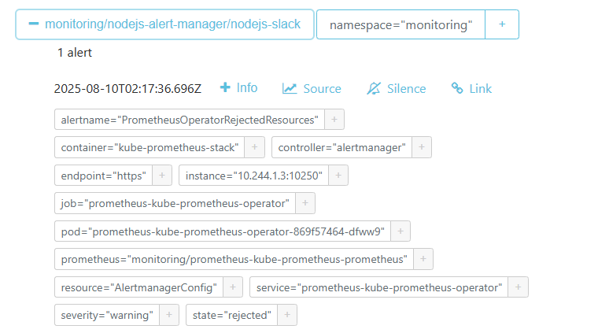
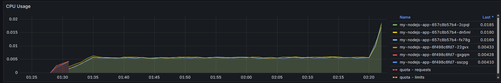
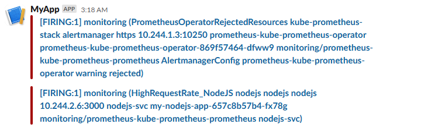
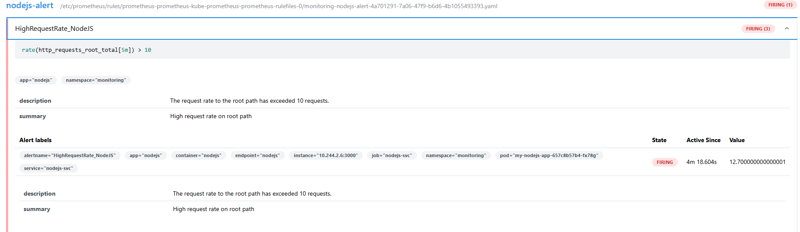
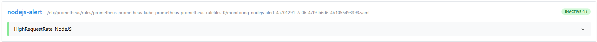

# Deploying a Node.js Application on Kubernetes with Prometheus and Grafana Monitoring

This project demonstrates how to deploy a Node.js application on Kubernetes with comprehensive monitoring using Prometheus and Grafana, complete with alerting via AlertManager and traffic simulation for testing.

## Table of Contents

- [Overview](#overview)
- [Architecture](#architecture)
- [Project Structure](#project-structure)
- [Prerequisites](#prerequisites)
- [Quick Start](#quick-start)
- [Application Details](#application-details)
- [Kubernetes Deployment](#kubernetes-deployment)
- [Monitoring Setup](#monitoring-setup)
- [Alerting Configuration](#alerting-configuration)
- [Traffic Simulation](#traffic-simulation)
- [Accessing Dashboards](#accessing-dashboards)

## Overview

This project provides a complete example of:

- **Node.js Application**: Express.js app with Prometheus metrics, health checks, and business logic
- **Containerization**: Docker container with security best practices
- **Kubernetes Deployment**: Production-ready K8s manifests with resource limits and health checks
- **Monitoring Stack**: Prometheus for metrics collection, Grafana for visualization
- **Alerting System**: AlertManager with configurable notification channels
- **Load Testing**: Python and shell scripts for generating various traffic patterns
- **Observability**: Comprehensive metrics, logging, and alerting for production monitoring

## Architecture



## Project Structure

```
nodejs-k8s-monitoring/
├── app/                          # Node.js application
│   ├── index.js                  # Main application file
│   └── Dockerfile                # Container definition
│  
├── k8s/                          # Kubernetes manifests
│   ├── nodejs-app.yaml           # Application deployment
│   ├── nodejs-svc.yaml           # Service and ServiceMonitor
│   ├── nodejs-monitor.yaml       # Prometheus and Grafana
│   ├── nodejs-alert.yaml         # Alert rules
│   └── nodejs-alert-manager.yaml # AlertManager configuration
│ 
├── scripts/                      # Testing and utility scripts
│   ├── k8s-Master.sh             # Deploy Master Node 
│   ├── k8s-Worker1.sh            # Deploy Worker Node 1 
│   ├── k8s-Worker2.sh            # Deploy Worker Node 2
│   └── send_request.sh           # Traffic generator
│ 
└── README.md                     # This documentation
```
## Prerequisites

Before you begin, ensure you have the following installed:

- **Kubernetes Cluster**:Kubeadm, minikube, kind, or any K8s cluster (v1.20+)
- **kubectl**: Kubernetes command-line tool
- **Docker**: For building container images
- **bash**: For shell scripts

### Optional Tools
- **Helm**: For easier Prometheus/Grafana installation (alternative approach)

## Quick Start

### Clone and Setup

```bash
# Clone the project
git clone https://github.com/m0h4j1r/nodejs-k8s-monitoring.git
cd nodejs-k8s-monitoring
```
### Kubernetes Cluster Setup on AWS EC2 (Ubuntu) using kubeadm

This guide sets up a **Kubernetes cluster** with:
- **1 Master Node**
- **2 Worker Nodes**
- **Ubuntu EC2 instances**
- **Automated via setup scripts**
---
### Prerequisites
- AWS account with permissions to launch EC2 instances.
- Security group allowing:
  - **SSH** (TCP/22) from your IP
  - **Kubernetes API** (TCP/6443) between nodes
  - **NodePort range** (TCP/30000-32767) between nodes
  - **Calico/Flannel ports** (UDP/8472, TCP/179)
- EC2 instances:
  - **Ubuntu 22.04 LTS**
  - Master & Worker: `t3.medium` (min. 2 vCPUs, 4 GB RAM)
- SSH key pair

### Script preparation
# Make [scripts](./scripts) executable
```bash
chmod +x scripts/*.sh
```

- [Master Node](./scripts/k8s-Master.sh)
- [Worker Node 1](./scripts/k8s-Worker1.sh)
- [Worker Node 2](./scripts/k8s-Worker2.sh)


## Build and Deploy NodeJS app

### Prepare Setup Scripts

```bash
ubuntu@master:~/nodejs$ mkdir nodejs
ubuntu@master:~/nodejs$ vim index.js
```
# build app [index.js](./app/index.js)
```bash
# Build the Docker image
ubuntu@master:~/nodejs$ vim Dockerfile
ubuntu@master:~/nodejs$ docker build -t nodejs-app .
```
# Deploy to Kubernetes
```bash
kubectl apply -f k8s/nodejs-app.yaml
kubectl apply -f k8s/nodejs-svc.yaml
kubectl apply -f k8s/nodejs-monitor.yaml
kubectl apply -f k8s/nodejs-alert.yaml
kubectl apply -f k8s/nodejs-alert-manager.yaml
```

### Verify Deployment

```bash
# Check if all pods are running
kubectl get pods

# Check services
kubectl get services
```

### Access Dashboards

- **Application**: http://localhost:30080
- **Prometheus**: http://localhost:30090
- **Grafana**: http://localhost:30030 (admin/admin123)
- **AlertManager**: http://localhost:30093

### Generate Test Traffic

```bash
# Run mixed traffic simulation
./scripts/send_request.sh

```

## Application Details

### Node.js Application Features

The Node.js application (`app/index.js`) includes:

#### Core Functionality
- **Express.js Framework**: RESTful API with CORS support
- **Health Endpoints**: `/health` and `/ready` for Kubernetes probes
- **Business Logic**: Sample user management API endpoints
- **Error Simulation**: `/api/error` endpoint for testing alerts

#### Prometheus Integration
- **Metrics Endpoint**: `/metrics` exposing Prometheus-formatted metrics
- **Custom Metrics**:
  - `http_requests_total`: Counter for HTTP requests by method, route, and status
  - `http_request_duration_seconds`: Histogram for request duration
  - `active_connections`: Gauge for current active connections
  - `business_operations_total`: Counter for business operations by type

## Kubernetes Deployment

### Application Deployment (`nodejs-app.yaml`)

The deployment configuration includes:

#### Replica Management
- **3 Replicas**: High availability setup
- **Rolling Updates**: Zero-downtime deployments
- **Pod Disruption Budget**: Maintains availability during updates

### Service Configuration (`nodejs-svc.yaml`)

Three service types are configured:

1. **ClusterIP Service**: Internal cluster communication
2. **NodePort Service**: External access on port 30080
3. **ServiceMonitor**: Prometheus service discovery


## Monitoring Setup



### Prometheus Configuration

The monitoring stack (`nodejs-monitor.yaml`) includes:

#### Prometheus Features
- **Service Discovery**: Automatic target discovery via Kubernetes API
- **Retention**: 200h data retention
- **Admin API**: Enabled for advanced operations
- **Web UI**: Accessible on port 30090

#### Scrape Configurations
1. **Kubernetes Pods**: Auto-discovery of annotated pods
2. **Kubernetes Services**: Service-based discovery
3. **Static Targets**: Prometheus self-monitoring

### Grafana Configuration

#### Pre-configured Features
- **Prometheus Datasource**: Automatically configured
- **Admin Credentials**: admin/admin123 (change in production!)
- **Persistent Storage**: EmptyDir for demo (use PVC in production)

#### Dashboard Access
- **URL**: http://localhost:30030
- **Default Login**: admin/admin123
- **Datasource**: Pre-configured Prometheus connection

#### Recommended Dashboards
Import these Grafana dashboard IDs:
- **Node Exporter**: 1860 (if using node-exporter)
- **Kubernetes Cluster**: 7249
- **Prometheus Stats**: 2
- **Custom Application Dashboard**: Create using provided queries




## 🚨 Alerting Configuration

### Alert Rules (`nodejs-alert.yaml`)

The system includes comprehensive alerting rules:

#### Application Alerts
- **HighErrorRate**: Triggers when error rate > 5% for 2 minutes
- **HighResponseTime**: Triggers when 95th percentile > 1s for 3 minutes
- **ApplicationDown**: Triggers when application is unreachable for 1 minute
- **TooManyRequests**: Triggers when request rate > 100 RPS for 2 minutes

#### Infrastructure Alerts
- **HighMemoryUsage**: Triggers when memory usage > 80% for 5 minutes
- **HighCPUUsage**: Triggers when CPU usage > 80% for 5 minutes
- **PodRestarting**: Triggers on pod restarts
- **LowReplicaCount**: Triggers when available replicas < 2

#### Business Alerts
- **BusinessOperationFailureRate**: Monitors business logic failures
- **SlowOperations**: Monitors slow business operations

### AlertManager Configuration (`nodejs-alert-manager.yaml`)

#### Notification Channels
1. **Email Notifications**: Configured for different severity levels
2. **Slack Integration**: Ready for webhook configuration
3. **Webhook Receiver**: Test webhook for development



#### Inhibition Rules
Critical alerts suppress warning alerts for the same service to reduce noise.

### Webhook Receiver

A simple Python webhook receiver is included for testing:
- **Port**: 5001
- **Endpoint**: `/webhook`
- **Function**: Logs received alerts to console

## Traffic Simulation

### Script Traffic (`send_request.sh`)

A comprehensive Python script for generating various traffic patterns:

```bash
.\send_request.sh
```



## Accessing Dashboards

### Application Dashboard
- **URL**: http://localhost:30080
- **Endpoints**: All API endpoints accessible
- **Health**: http://localhost:30080/health
- **Metrics**: http://localhost:30080/metrics

### Prometheus Dashboard
- **URL**: http://localhost:30090
- **Features**:
  - Query interface for PromQL
  - Target discovery status
  - Alert rule evaluation
  - Configuration management

#### Useful Prometheus Pages
- **Targets**: http://localhost:30090/targets
- **Alerts**: http://localhost:30090/alerts
- **Rules**: http://localhost:30090/rules
- **Configuration**: http://localhost:30090/config

### Grafana Dashboard
- **URL**: http://localhost:30030
- **Login**: admin/admin123
- **Features**:
  - Pre-configured Prometheus datasource
  - Dashboard creation interface
  - Alert management
  - User management

#### Creating Custom Dashboards
1. Login to Grafana
2. Click "+" → "Dashboard"
3. Add panels with PromQL queries
4. Save dashboard

#### Recommended Panels
- **Request Rate**: `rate(http_requests_total[5m])`
- **Error Rate**: `rate(http_requests_total{status_code=~"5.."}[5m]) / rate(http_requests_total[5m])`
- **Response Time**: `histogram_quantile(0.95, rate(http_request_duration_seconds_bucket[5m]))`
- **Active Connections**: `active_connections`

### AlertManager Dashboard
- **URL**: http://localhost:30093
- **Features**:
  - Active alerts view
  - Silence management
  - Configuration status
  - Notification history




**Happy Monitoring!** 

This project demonstrates a complete production-ready setup for monitoring Node.js applications in Kubernetes. Use it as a foundation for your own monitoring infrastructure and customize it according to your specific requirements.
